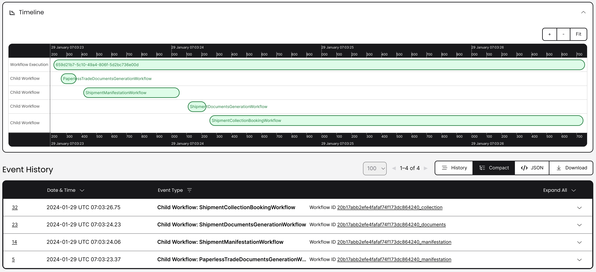
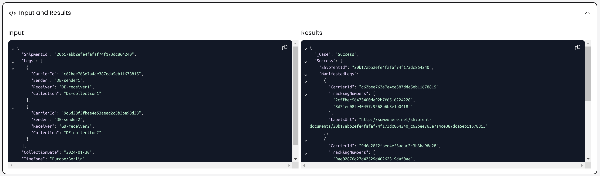
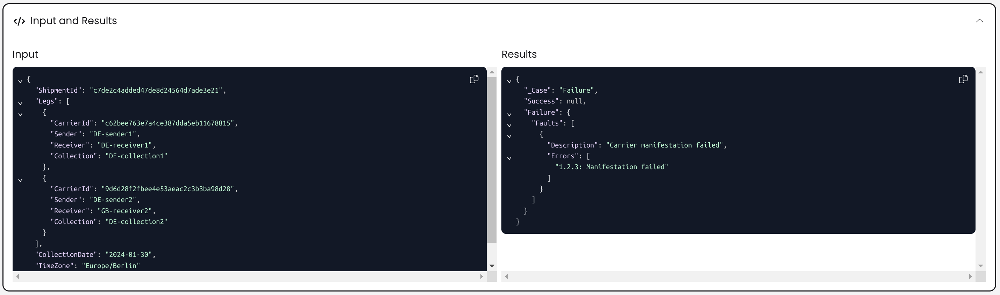

# Temporal.io as Durable Execution Infrastructure

## Overview

Follow-up to https://github.com/iblazhko/eventsourced-processmanager/

Refer to the [README](https://github.com/iblazhko/eventsourced-processmanager/blob/main/README.md)
there for the description of motivation and business domain.

While implementing a durable long-running process from scratch can be
a lot of fun, in a production development environment for most companies
it does not make much sense to spend significant resources on implementing
and maintaining such infrastructure code. There are multiple out-of-the-box
solutions available that allow application developers to focus on writing code
that implements business requirements.

This example explores an option of using [Temporal.io](https://temporal.io/)
as processing infrastructure.

Temporal is an implementation of *Durable Execution* concept. In Temporal's
own words

> Durable execution systems run code in a way that persists each step the code
> takes. If the process or container running the code dies, the code
> automatically continues running in another process with all state intact,
> including call stack and local variables.

## Example Solution Components

> Refer to the [Event-Sourced Process Manager README](https://github.com/iblazhko/eventsourced-processmanager/blob/main/README.md#business-domain) for the description of business domain.

Temporal is flexible when it comes to composing process definitions.

There are Workflows and Activities, and Workflows can call another Workflows.
See [Temporal Concepts](https://docs.temporal.io/concepts) for more details.

This example uses one of many possible process composition options:

1. Entry point workflow to validate and classify shipment
2. Top-level workflow for each shipment process category (domestic,
  international, etc.)
3. Workflow to manifest shipment as a whole
4. Workflow to generate shipment documents
5. Workflow to schedule shipment collection and book collection with carrier
6. Carrier integration workflows (manifest, book collection etc)

For educational purposes this example uses 5 hosts:
* Orchestrator host: Temporal worker for 1 and 2 from the list above
* Shipment manifestation host: Temporal worker for 3 from the list above
* Documents generation host: Temporal worker for 4 from the list above
* Collection booking scheduling host: Temporal worker for 5 from the list above
* Carrier integration host: Temporal worker for 6 from the list above

This was done to demonstrate composition options, real deployment will
probably end up with fewer hosts.

## Executing the Process

Assuming that .NET 8 SDK, PowerShell Core 7, and Docker with Docker Compose
plugin are installed.

Start the Temporal infrastructure and workers (application hosts)
in Docker Compose:

```bash
./build.ps1 DockerCompose.Start
```

Trigger the process - use example below as-is or use a random guid for
shipment id. Real application can use a message consumer or whatever method is
applicable to trigger a process.

```bash
http post http://localhost:43210/{shipmentId}
```

To emulate various aspects of the process, code in this example looks into
shipment id:

* Shipment process classification:
  * id starting with `1` triggers "domestic" process
  * id starting with `2` triggers "international with paperless trade" process
  * otherwise "international" process is used
* Failures handling:
  * id ending with `1` triggers process that fails at manifestation stage
  * id ending with `2` triggers process that fails at collection booking stage
  * otherwise the process should complete successfully straight away

> Note that while from a business domain perspective outcome may be a failure
> (shipment manifestation failed, collection booking failed etc), from the
> Temporal's point of view corresponding workflow is completed successfully
> if all the steps in the process were executed and there were no unhandled
> exceptions. Hence, all the workflows are expected to be marked as "Completed"
> in the Temporal dashboard once the process finished.
> Look into the workflow result in the Temporal workflow "Input and Results"
> section to determine whether it was a success or failure from the business
> domain perspective.

Example:

```bash
http post http://localhost:43210/15916b8a5d11456f9934ed91c2bd82c0
http post http://localhost:43210/15916b8a5d11456f9934ed91c2bd82c1
http post http://localhost:43210/15916b8a5d11456f9934ed91c2bd82c2

http post http://localhost:43210/20b17abb2efe4fafaf74f173dc864240
http post http://localhost:43210/20b17abb2efe4fafaf74f173dc864241
http post http://localhost:43210/20b17abb2efe4fafaf74f173dc864242

http post http://localhost:43210/c7de2c4added47de8d24564d7ade3e20
http post http://localhost:43210/c7de2c4added47de8d24564d7ade3e21
http post http://localhost:43210/c7de2c4added47de8d24564d7ade3e22
```

Observe workflows in Temporal dashboard: `http://localhost:8080/`

Shipment process timeline:



Success:



Failure:



Alternatively, use API to get the outcome of a workflow.

Example of a successful outcome:

```bash
http get http://localhost:43210/15916b8a5d11456f9934ed91c2bd82c0
```

```json
{
    "outcome": {
        "collectionBooking": {
            "bookingReference": "4b259974ca104b24b715d9f7a9e6ef99",
            "carrierId": "c62bee763e7a4ce387dda5eb11678815",
            "locationReference": "9cc4542c90c74d15b1b4aedca3e1a134"
        },
        "manifestedLegs": [
            {
                "carrierId": "c62bee763e7a4ce387dda5eb11678815",
                "labelsUrl": "http://somewhere.net/shipment-documents/15916b8a5d11456f9934ed91c2bd82d0_c62bee763e7a4ce387dda5eb11678815",
                "trackingNumbers": [
                    "e2fdb6ebf64641dda510d5ff82771839",
                    "e4506ebb433345a791753e3b709a9e72"
                ]
            }
        ],
        "shipmentDocuments": {
            "combinedDocumentUrl": "http://somewhere.net/shipment-documents/15916b8a5d11456f9934ed91c2bd82d0_combined_document",
            "invoiceUrl": null,
            "labelsUrl": "http://somewhere.net/shipment-documents/15916b8a5d11456f9934ed91c2bd82d0_labels",
            "receiptUrl": "http://somewhere.net/shipment-documents/15916b8a5d11456f9934ed91c2bd82d0_receipt"
        }
    },
    "shipmentId": "15916b8a5d11456f9934ed91c2bd82d0",
    "status": "Success"
}
```

Example of a failure:

```bash
http get http://localhost:43210/15916b8a5d11456f9934ed91c2bd82c1
```

```json
{
    "failure": {
        "faults": [
            {
                "description": "Carrier manifestation failed",
                "errors": [
                    "1.2.3: Manifestation failed"
                ]
            }
        ]
    },
    "shipmentId": "15916b8a5d11456f9934ed91c2bd82d1",
    "status": "Failure"
}
```
### Load Test

To see how the system behaves under load, we can inject large number of
shipments using following command (adjust number of workers, shipments,
and delay as needed):

```powershell
./load_test.ps1 -WorkersCount 10 -WorkerShipmentsCount 1000 -WorkerDelayMilliseconds 50
```

This example starts 10 workers in parallel, each worker will trigger 1000
shipment processes waiting 50ms between operations.

Monitor Temporal dashboard `http://localhost:8080/` to see the progress.

Once all the workflows are completed, there wil be around 78K workflows listed
in dashboard.

Local run shows that CPU consumption is high for Temporal server and
Postgres containers, Temporal worker container CPU consumption is lower however
this may be due to the fact that this solution uses large number of Temporal
worker hosts, so load is distributed between them.

Compared to custom Event Sourced implementation, CPU consumption and I/O load
seem to be much higher.

Worth mentioning that there is a large number of internal errors in
Temporal logs, such as

```
Workflow task not found
History client encountered error
Workflow task already started
Activity task already started
Fail to process task
```

however it looks like Termporal server was able to recover - all workflows are
marked as Completed eventually.

Under high load, it may take a long time to complete a workflow - could be
over 20min.

> **Note**: Code in this example is not optimised for performance.
> In a real deployment we could consider using Temporal cluster with multiple
> Temporal server instances. Also Postgres instance may need tuning /
> scaling up / scaling out.

## Comparing with custom Event Sourced implementation

While both Event Sourcing and Durable Execution can help with implementing a
durable long-running process, these are two different concepts, and they focus
on different aspects.

Durable Execution concepts are better aligned with the *processing* aspect;
Event Sourcing is about *representing state as a sequence of events*, and that
can be applied both to the business domain and to the technical / infrastructure
domain.

Temporal uses event sourcing internally, however from an application developer
perspective it is not a direct replacement of event sourcing for business domain
events:

1. Temporal SDK isolates this aspect from application code that implements
  workflows and activities
2. Temporal [workflow events](https://docs.temporal.io/workflows#event-history)
  are aligned with the Temporal concepts, not with application domain concepts -
  we may see events like `WorkflowExecutionStarted` or `WorkflowTaskScheduled`
  in workflow events history
3. Temporal workflows may or may not be aligned with business domain entities.

OTOH, the record of the fact that Temporal activity or workflow completed can be
treated as a business domain event if we squint a little, although it will be
much less explicit compared to a dedicated domain event stored in an entity
event stream, and it would be considered a code smell from Event Sourcing
point of view.

Custom durable process implementation that uses event sourcing may be better
aligned with the business domain but requires much more investment in
implementing infrastructure aspects like retries and timeouts; also defining and
maintaining the process definition as a whole may be non trivial. And here we
may have a problem opposite to the one described above - in a custom event
sourced implementation we may need events not directly related to the business
domain to implement technical aspects.

Using Temporal in conjunction with event sourced aggregates is out of the scope
of this example, but in principle process steps implementation, in particular
Activities implementation, can invoke even sourced aggregates or publish domain
events if we e.g. need to notify other systems or components about the
process progress. That would allow a better separation between technical aspects
of implementing a durable process and specifics of a business domain.

## Conclusions

My initial impressions after trying out Temporal are very positive.

### Benefits

* Temporal.io encapsulates all workflow-related infrastructure aspects
  * retry policies, timeouts, durability, reliability, observability,
    workflow versioning
* Easy to implement business requirements
  * Process is defined directly in code
  * Process is easy to compose from workflows and activities
* Easy to manage and monitor progress
  * Admin interface (web and cli) is available out of the box
  * Can search for workflows by various criteria, and see the workflow state
  * Observability is built-in, can see timeline with workflows / activities
    connections, and inputs/outputs
* Supports multiple programming languages  
* Fully managed [cloud hosting](https://temporal.io/cloud) is available;
  can use self-hosting option as well
* [Commercial support](https://docs.temporal.io/cloud/support) available
* Good [documentation](https://docs.temporal.io/dev-guide) and
  [training materials](https://learn.temporal.io/courses/)

### Concerns

Points below are not a criticism of Temporal as such, just some observations.

* At the moment, .NET support in Temporal is not as good as for other languages
  (e.g. no tutorials and no 101 course), but documentation is improving and
  the Temporal .NET SDK seems to be stable already.
* Determinism is expected from a workflow implementation code, but it is not
  enforced or validated (to the best of my knowledge). Writing deterministic
  code is quite natural to someone familiar with functional programming,
  but if an application developer is coming from a procedural / OOP background,
  some adaptation may be required.
* Workflows and Activities inputs/outputs, and Workflows internal state
  variables must use serialization-friendly types. There is no Temporal .NET
  SDK documentation available yet where it would have been described
  (to the best of my knowledge), but this is implied by the fact that inputs,
  outputs, and internal variables are serialized and persisted at every
  workflow step. Using type that is not fully compatible with JSON serializer
  (e.g. `OneOf` that otherwise would have been extremely useful) may lead to
  hidden errors that may only be exposed at runtime. This example is
  [designed carefully](https://github.com/iblazhko/temporal-processmanager/blob/main/src/SharedKernel/DTOs/DtoModels.cs#L3-L49)
  to avoid issues with serialization/deserialization.
* Temporal is very chatty by design, activities input/output and state at each
  checkpoint are serialized and persisted in the workflow's
  [events history](https://docs.temporal.io/workflows#event-history);
  large number of activities in a workflow may introduce latency and increase
  storage space requirements. Production application would need to evaluate that
  * all process triggers can be handled within the expected time frame
  * storage requirements for Temporal are reasonable.

Also, blog post ["Common Pitfalls with Durable Execution Frameworks"](https://medium.com/@cgillum/common-pitfalls-with-durable-execution-frameworks-like-durable-functions-or-temporal-eaf635d4a8bb)
describes concerns applicable to Durable Execution in general.

### Alternatives

There are other frameworks available that implement Durable Execution concept:

* [Azure Durable Functions](https://learn.microsoft.com/en-us/azure/azure-functions/durable/) (.NET, Python, JavaScript)
* [Convex](https://www.convex.dev/) (TypeScript)
* [LittleHorse](https://littlehorse.dev/) (Go, Java, Python, .NET)
* [Orkes](https://orkes.io/) (.NET, Go, Java, Clojure, Python, JavaScript)
* [Rama](https://redplanetlabs.com/) (Java, Clojure)
* [Restate](https://restate.dev/) (TypeScript, Java)
